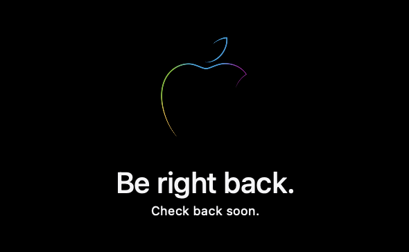

# Be Right Back Saver

A macOS screen saver of the “Be right back“ page Apple uses when refreshing their store.

## Installation
**Either:**  
• [Download here](./Resources/BeRightBack.saver)  
• Open “BeRightBack.saver”  
**OR:**  
• Clone this repo  
• Open the Xcode project  
• Build the project, and open the screensaver produced.